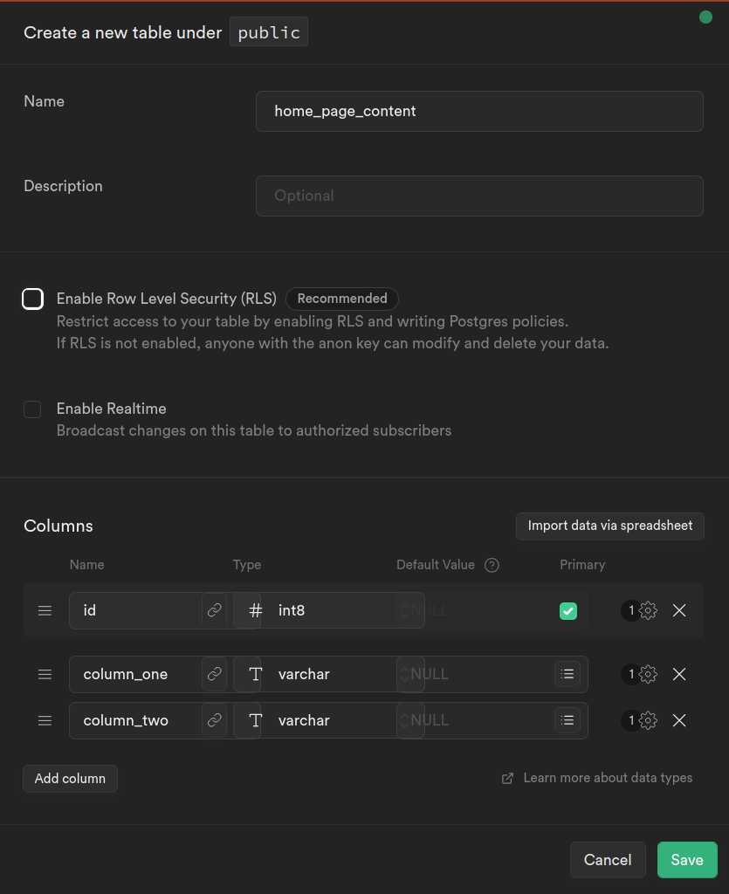
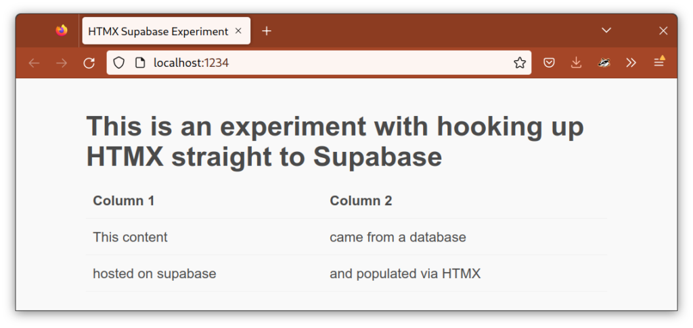

Thanks to our friends [HTMX](https://htmx.org/), [Supabase](https://supabase.com/), and a touch of some [lesser known SQL](https://www.postgresql.org/docs/current/functions-xml.html), yes. Here's how.

Supabase is exceedingly easy to get going with. I've yet to encounter a single source of friction in starting a basic project and setting up my database.

I created this dummy table with the foolproof GUI.



Then I populated some data.


Now here's the magic. We can generate XML via our SQL query using Postgres's XML functions. I've wrapped it in a function to make it easy to call.

<script src="https://gist.github.com/er2/a34f3245229bba9821261bc50def5ef7.js"></script>

This creates the following HTML

```
<table>
  <th>Column 1</th>
  <th>Column 2</th>
  <tr>
      <td>This content</td>
      <td>came from a database</td>
  </tr>
  <tr>
      <td>hosted on supabase</td>
      <td>and populated via HTMX</td>
  </tr>
</table>
```

| Column 1 | Column 2 |
| --- | --- |
| This content | came from a database |
| hosted on supabase | and populated via HTMX |

Simply by creating this function, Supabase automatically create an API for us using PostgREST. The API Docs section shows use exactly how to use it.

```
curl -X POST 'https://<my-project-id>.supabase.co/rest/v1/rpc/home' \
-H "Content-Type: application/json" \
-H "apikey: SUPABASE_KEY" \
-H "Authorization: Bearer SUPABASE_KEY"
```

Here's the HTML of our web page which calls our function using HTMX

<script src="https://gist.github.com/er2/f8a999231a550a555b9977ac2c36d582.js"></script>

<figure>



<figcaption>

And the result

</figcaption>

</figure>

There was just one snag in this all, which is that Supabase currently only returns query results as JSON, so it wraps our HTML in quotes. Luckily HTMX offers hooks into its workings, via event handlers and stripping those quotes is trivial. But I plan to submit a feature request to Supabase. I figure they could omit the quotes when using the header `Content-Type: application/xml`. This particular use case of conflating HTML and XML might be considered hacky, but I think it's very reasonable to want to create an XML API using Supabase and SQL XML functions.
